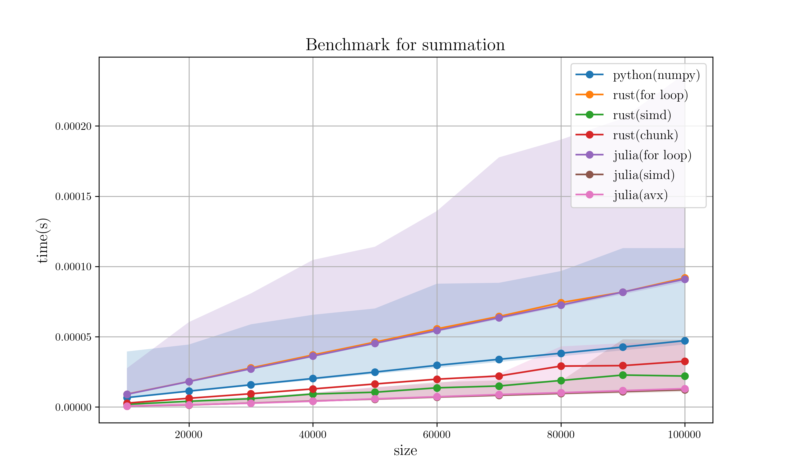
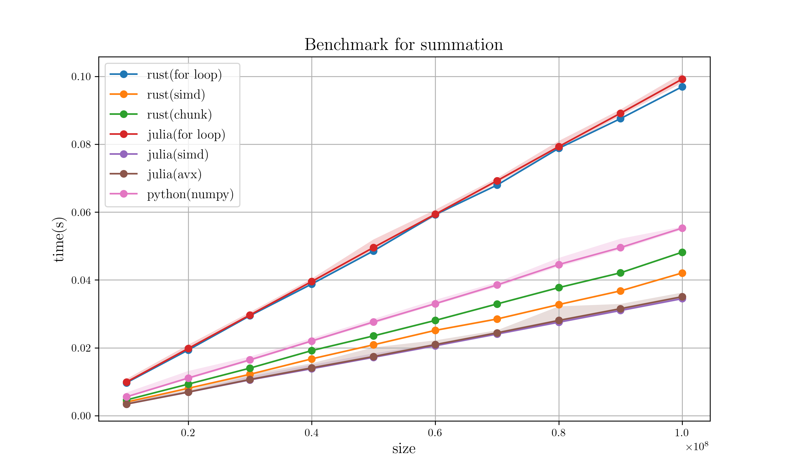

# Summation benchmark

## Description

```python
# Python Code for description
def for_sum(x):
    s = 0
    for t in x:
        s += t
    return s
```

## Hardware specification

* CPU: 6-Core Intel Core i7-9750H (-MT MCP-) speed/min/max: 892/800/4500 MHz 
* Kernel: 5.10.16-arch1-1

## Compilation option

* Rust : `cargo bench`
* Julia : `julia -O3`
* D : `dub run -b=release-nobounds`

## Specific version

* Rust : `rustc 1.51.0-nightly`
    * `packed_simd_2`: `0.3`
* Julia : `julia version 1.5.3`
* Python : `Python 3.9.1`
    * numpy : `1.20.0`
* D : `LDC 1.39`

## Result

### 1. Small Size Array (10000 ~ 100000)


### 2. Large Size Array (10000000 ~ 100000000)

