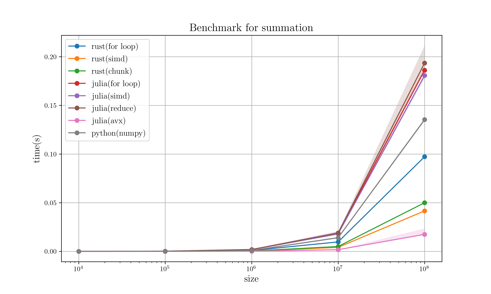

# Summation benchmark

## Description

```julia
# Julia Code for description
function sum_for(p::Int)::Float64
    x = 0.0:Float64(10^p) # 0 to 10^p
    s = 0.0
    for t in x
        s += t
    end
end
```

## Hardware specification

* CPU: 6-Core Intel Core i7-9750H (-MT MCP-) speed/min/max: 892/800/4500 MHz 
* Kernel: 5.10.16-arch1-1

## Compilation option

* Rust : `RUSTFLAGS='-C target-cpu=native' cargo build --release`

## Specific version

* Rust : `rustc 1.51.0-nightly`
    * Peroxide : `0.30.3`
* Julia : `julia version 1.5.3`
* Python : `Python 3.9.1`
    * numpy : `1.20.0`

## Result

### 1. Semi-Log scale plot (without python)


### 2. Log-Log plot

