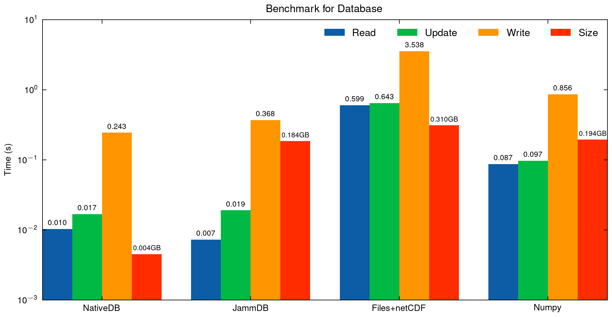

# Database benchmark

## Description

```python
# Python Code for Description
# import ...

def write():
    data_dir = "data/numpy"
    # ...
    m_vec = np.random.rand(100 * 500)
    m_vec[9301] = 0.1
    for i in range(100):
        for j in range(500):
            m = m_vec[i * 500 + j]
            matrix = np.random.rand(500, 4)
            np.savez(f"{data_dir}/run_{i:03d}/trial_{j:04d}/data", m=m, matrix=matrix)

def update():
    data_dir = "data/numpy"
    for i in range(100):
        for j in range(500):
            data = np.load(f"{data_dir}/run_{i:03d}/trial_{j:04d}/data.npz")
            if data["m"] == 0.1:
                matrix = np.zeros((500, 4))
                np.savez(f"{data_dir}/run_{i:03d}/trial_{j:04d}/data", m=0.1, matrix=matrix)

def read():
    dir = "data/numpy"
    for i in range(100):
        for j in range(500):
            npz_dir = f"{dir}/run_{i:03d}/trial_{j:04d}/data.npz"
            data = np.load(npz_dir)
            if data["m"] == 0.1:
                print(f"id: {i:03d}, j: {j:04d}, m: {data['m']}")
                print(data["matrix"][0,:])
```

## Hardware specification

* CPU: 13th Gen Intel i5-1340P (16) @ 4.600GHz
* Kernel: 6.5.13-7-MANJARO

## Compilation option

* Rust : `cargo build --release`

## Specific version

* Rust : `rustc 1.75.0`
    * `peroxide` : `0.34.4`
    * `serde` : `1.0.196`
    * `nativedb` : `0.5.3`
    * `jammdb` : `0.11.0`
* Python : `Python 3.11.6`
    * `numpy` : `1.26.2`

## Result


