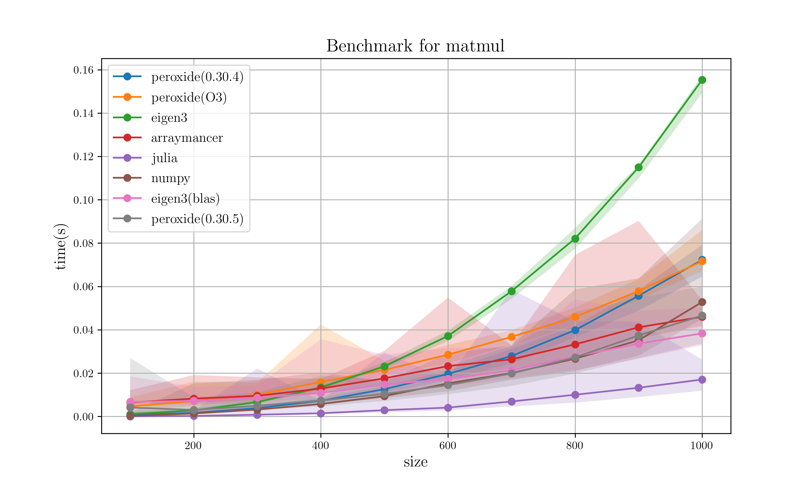

# Matrix multiplcation benchmark

## Hardware specification

* CPU: 6-Core Intel Core i7-9750H (-MT MCP-) speed/min/max: 892/800/4500 MHz 
* Kernel: 5.10.16-arch1-1

## Compilation option

* Rust : `RUSTFLAGS='-C target-cpu=native' cargo build --release`
* Rust(BLAS) : `RUSTFLAGS='-C target-cpu=native' cargo build --release --features O3`
* C++ : `g++ -I$EIGEN -O2`
* C++(BLAS) : `g++ -I$EIGEN -I$OPENBLAS -lopenblas -O2`
* Julia : `@benchmark`
* Nim : `nimble build -d:release -d:danger -d:openblas -d:blas=cblas`

## Specific version

* Rust : `rustc 1.51.0-nightly`
    * Peroxide : `0.30.4`
* C++ : `gcc version 10.2.0`
    * Eigen : `3.3.7`
* Julia : `julia version 1.5.3`
* Python : `Python 3.9.1`
    * numpy : `1.20.0`
* Nim : `Nim Compiler Version 1.5.1 [Linux: amd64]`
    * arraymancer : `0.6.2`

## Result

